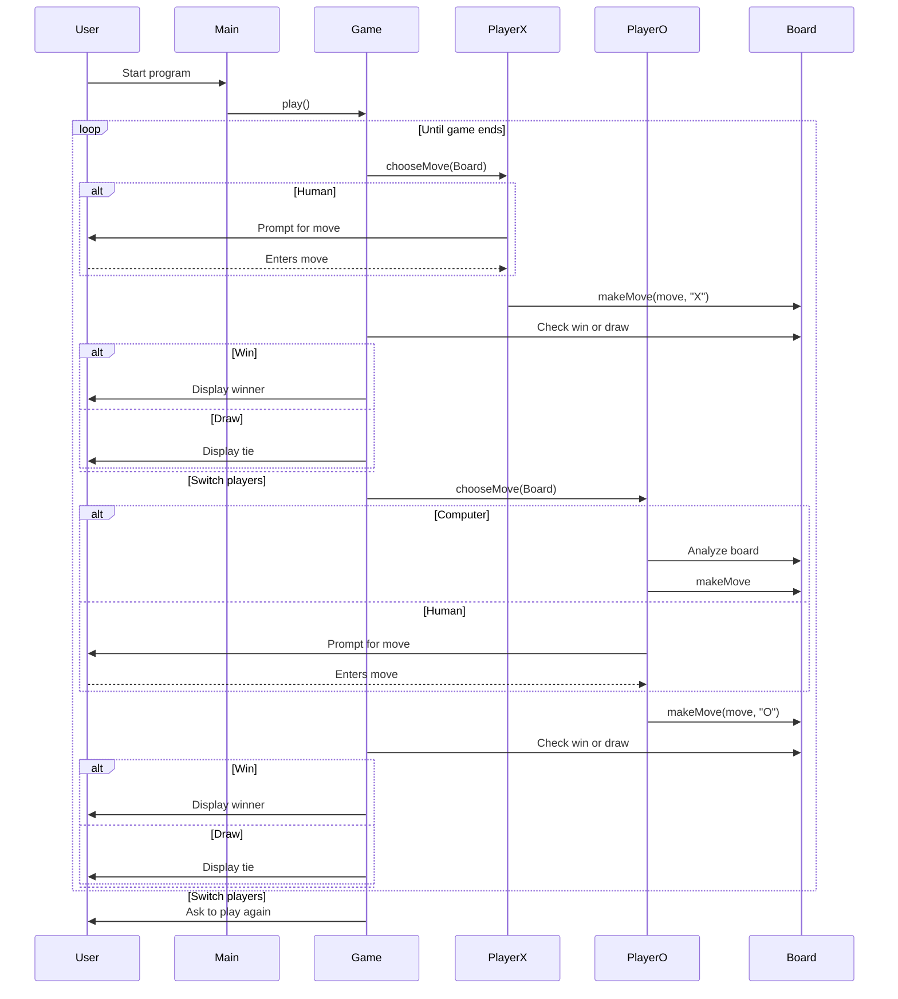

# Tic-Tac-Toe Console Game (Java)

This project is a console-based implementation of Tic-Tac-Toe supporting three modes:

1. Human vs Human  
2. Human vs Computer  
3. Computer vs Human

Players take turns entering moves (1–9) on a 3×3 board. Player X goes first by default unless overridden by game settings. Input is validated to prevent invalid, out-of-range, or already-occupied entries. The game detects wins, draws, and offers a replay prompt.

## Opportunistic Computer Player

When playing against the computer, it uses an **opportunistic strategy**, checking moves in this order:

1. If it’s the first move, choose a corner.
2. If it’s the second move and the center is available, take it.
3. If it can win, make the winning move.
4. If the opponent is about to win, block them.
5. Otherwise, make a random valid move.

This AI uses a greedy but simple strategy — no lookahead.

---

## Getting Started

Clone and run:

```bash
git clone https://github.com/judith-java2/Portfolio.git
cd Portfolio
./gradlew build       # Compile
./gradlew run         # Launch game


```mermaid
classDiagram
    class TicTacToe {
        +main(String[]) : void
    }

    class Game {
        +play() : String
    }

    class Board {
        +makeMove(int, String) : void
        +isValidMove(int) : boolean
        +print() : void
        +getCells() : String[]
        +isFull() : boolean
    }

    class GameLog {
        +recordWin(String) : void
        +recordTie() : void
        +printLog() : void
        +saveToDisk(String) : void
    }

    class GameResultChecker {
        +hasWinner(Board, String) : boolean
    }

    interface Player {
        +getSymbol() : String
        +chooseMove(Board) : int
    }

    class HumanPlayer implements Player
    class OpportunisticComputerPlayer implements Player
```


